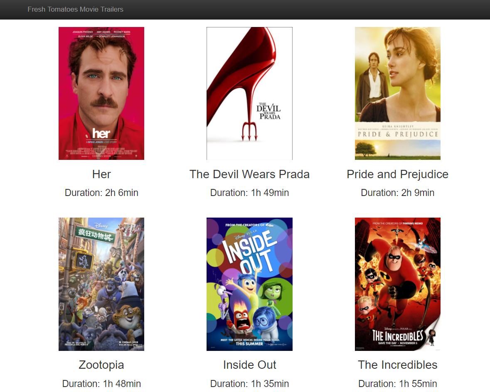
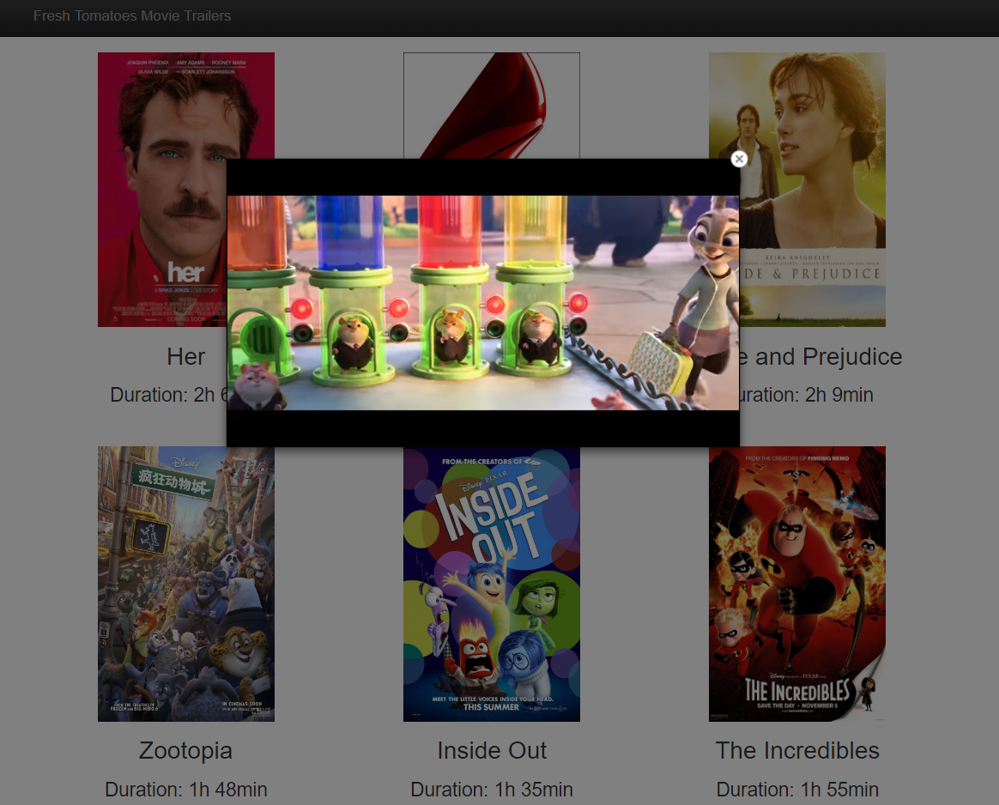

# :movie_camera: Movie Trailer Website :movie_camera:

## :pencil: How To Use The Application :pencil:

### Open CLI :rocket:

1. For Mac Users: to open Terminal, you may do either of the following:

    * Open the Finder. Locate and open the `Applications` folder. Open the `Utilities` folder, and from there, open the `Terminal` application.
    * Use a shortcut. Open Spotlight by using the keyboard shortcut `Command` + `spacebar`. Type in `Terminal`, and hit the `RETURN` key when the Terminal application is suggested or highlighted.

2. For Windows Users: to open CMD, you may do as the following:
    * Use a shortcut. Open `Run` by using the keyboard shortcut `Windows` + `R`. Type in `CMD`, and hit the `Enter` key.

### Launch The Application :clapper:

1. Use the command line to navigate to the directory in where the `entertainment_center.py` is in.
2. Execute the command `python entertainment_center.py` to Launch the application.
3. Home page will open in your browser, as shown blow:

   
2. Click on a movie image, you can watch its trailer, as shown blow:

   

## Different Versions 🗃

### `only_youtube_url` Directory

There are only trailer urls from youtube.

### `only_youku_url` Directory

There are only trailer urls from youku.

### `youtube_and_youku` Directory

The first 3 trailer urls are from youtube, and the rest of urls are from youku. 